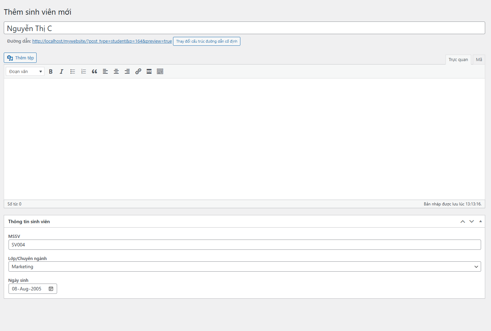
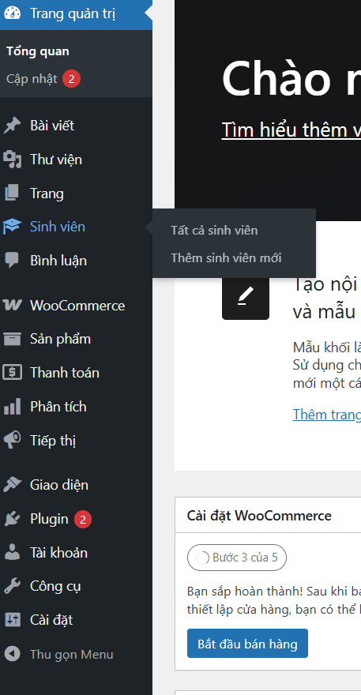
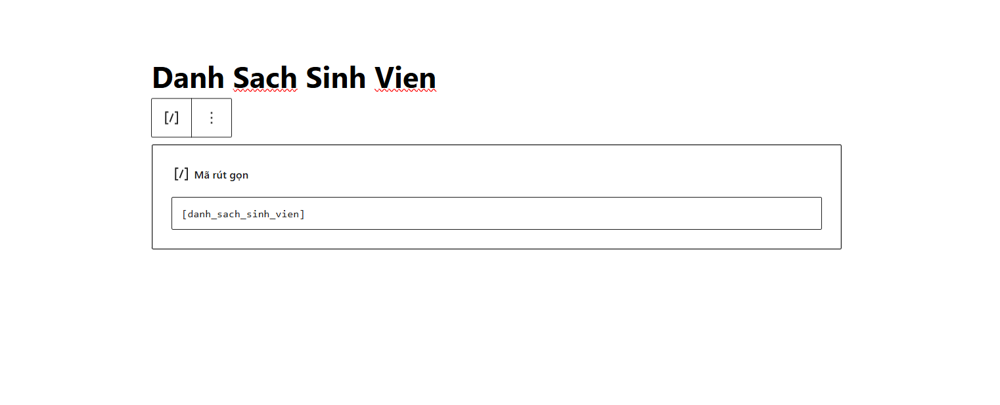
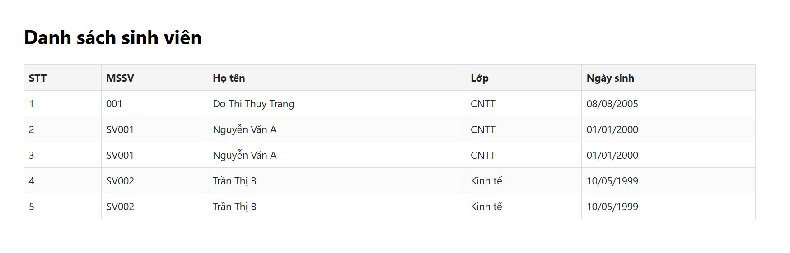

# Student Manager (Plugin)

Plugin này đăng ký Custom Post Type `Sinh viên` và cung cấp metabox để nhập dữ liệu MSSV, Lớp, Ngày sinh; đồng thời cung cấp shortcode `[danh_sach_sinh_vien]` để hiển thị danh sách dưới dạng bảng.

Thư mục plugin: `wp-content/plugins/student-manager/`

Hướng dẫn nhanh:

- Kích hoạt plugin: Copy thư mục `student-manager` vào `wp-content/plugins/` và kích hoạt trong Dashboard → Plugins.
- Tạo Sinh viên: Dashboard → Sinh viên → Thêm mới. Nhập `Họ tên` (title), `Tiểu sử` (editor), và phần `Thông tin sinh viên` (MSSV, Lớp, Ngày sinh).
- Hiển thị danh sách: Chèn shortcode `[danh_sach_sinh_vien]` vào một Page.

Files chính đã tạo:

- student-manager.php
- includes/cpt.php
- includes/meta-boxes.php
- includes/shortcode.php
- assets/css/style.css

Add screenshots

Place your screenshots into the `assets/imgs/` folder. Example names used in this README:

- `assets/imgs/screenshot.png` — frontend list view
- `assets/imgs/screenshot-2.png` — backend add-new view

PowerShell example to copy screenshots from your machine into the plugin folder:

```powershell
Copy-Item "C:\path\to\your\screenshot.png" -Destination "d:\xampp\htdocs\mywebsite\wp-content\plugins\student-manager\assets\imgs\screenshot.png" -Force
Copy-Item "C:\path\to\your\screenshot-2.png" -Destination "d:\xampp\htdocs\mywebsite\wp-content\plugins\student-manager\assets\imgs\screenshot-2.png" -Force
```

Once the files are in `assets/imgs/`, include them in README or pages like this (this repo already contains the uploaded images named `image1.png`..`image4.png`):









Notes

- After adding images, you can recreate the plugin zip: `Compress-Archive -Path "d:\xampp\htdocs\mywebsite\wp-content\plugins\student-manager\*" -DestinationPath "d:\xampp\htdocs\mywebsite\student-manager.zip" -Force`.
- If you want, paste base64 image data here and I can write the files for you.

